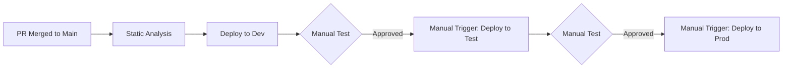

# Fabric CI/CD Reference Architecture

A reference architecture for implementing CI/CD pipelines for Microsoft Fabric workspaces using GitHub Actions and the `fabric-cicd` Python library.

## Overview

This repository demonstrates best practices for deploying Microsoft Fabric workspace items (Lakehouses, Notebooks, Pipelines, Semantic Models, etc.) across multiple environments using Git-based version control and automated deployment pipelines.

### Architecture

- **Medallion Architecture**: Bronze → Silver → Gold data layers
- **Multi-stage Deployment**: Dev → Test → Production with approval gates
- **Git-based Deployment**: Single source of truth in `main` branch
- **ID Transformation**: Automatic adjustment of workspace-specific references

### Workspace Structure

```
Fabric Blueprint/
├── 1_Bronze/          # Raw data ingestion
├── 2_Silver/          # Transformed/cleansed data
├── 3_Gold/            # Business-ready analytics
└── 4_Analytics/       # Semantic models, reports, agents
```

## Prerequisites

### Azure Setup

1. **Azure Service Principal** with permissions:
   - Fabric Workspace Admin or Contributor
   - Azure subscription access

2. **Microsoft Fabric Workspaces**:
   - `[D] Fabric Blueprint` - Development environment
   - `[T] Fabric Blueprint` - Test environment
   - `[P] Fabric Blueprint` - Production environment

### GitHub Setup

Configure the following **GitHub Secrets** in your repository:
- `AZURE_CLIENT_ID` - Service Principal Client ID
- `AZURE_CLIENT_SECRET` - Service Principal Secret
- `AZURE_TENANT_ID` - Azure AD Tenant ID
- `AZURE_SUBSCRIPTION_ID` - Azure Subscription ID

**To add secrets**: Go to repository Settings → Secrets and variables → Actions → New repository secret

### GitHub Environments (Optional but Recommended)

For approval gates, configure GitHub environments:
1. Go to Settings → Environments
2. Create environments: `dev`, `test`, `production`
3. For `test` and `production`, add required reviewers

## Getting Started

### 1. Configure Parameter File

Edit [`parameter.yml`](parameter.yml) to add your Dev workspace IDs:

```yaml
find_replace:
  - find_value: "your-dev-lakehouse-bronze-id"
    replace_value:
      _ALL_: "$items.Lakehouse.lakehouse_bronze.id"
    item_type: "Notebook"
```

**How to find Item IDs**:
1. Open your Dev workspace in Fabric
2. Navigate to workspace settings or item details
3. Copy the Item ID (GUID format)

### 2. Initial Setup

```bash
# Clone the repository
git clone https://github.com/dc-floriangaerner/fabric-cicd.git
cd fabric-cicd

# Create a feature branch
git checkout -b feature/my-feature

# Make changes to Fabric items
# ... edit items in "Fabric Blueprint/" directory ...

# Commit and push
git add .
git commit -m "Add new feature"
git push origin feature/my-feature
```

### 3. Deploy via Pull Request

1. Create a Pull Request to `main` branch
2. Wait for review and approval
3. Merge PR to `main`
4. **Automatic deployment to Dev** starts immediately

### 4. Promote to Test/Production

After successful Dev deployment and manual testing:

1. Go to **Actions** tab in GitHub
2. Select "Deploy to Microsoft Fabric" workflow
3. Click "Run workflow"
4. Select options:
   - ☑️ Deploy to Test environment
   - ☐ Deploy to Production environment
5. Click "Run workflow"
6. Approve deployment in GitHub (if environment protection is enabled)

Repeat for Production when ready.

## CI/CD Pipeline

### Workflow Stages



### Static Analysis

Before deployment, the pipeline validates:
- ✅ JSON syntax in all item definitions
- ✅ Python syntax in notebooks
- ✅ Required metadata files present
- ✅ Repository structure integrity

### Deployment Process

For each environment (Dev/Test/Prod):

1. **Authenticate** to Azure using Service Principal
2. **Transform IDs** based on `parameter.yml` configuration
3. **Deploy items** using `fabric-cicd` library
4. **Clean up orphans** - remove items not in repository
5. **Report status** in GitHub Actions summary

### ID Transformation

The pipeline automatically replaces environment-specific IDs:

| Type | From (Dev) | To (Target Env) |
|------|-----------|-----------------|
| Lakehouse IDs | Dev lakehouse ID | Target env lakehouse ID |
| Workspace IDs | Dev workspace ID | Target env workspace ID |
| SQL Endpoints | Dev SQL endpoint | Target env SQL endpoint |
| Connections | Dev connection ID | Target env connection ID |

## Development Workflow

### Branch Strategy

- **main**: Protected branch, single source of truth
- **feature/\***: Short-lived feature branches
- **Private dev branches**: Individual developer isolation

### Best Practices

1. **Small, frequent commits** - Keep changes atomic
2. **Test locally** - Use private dev workspace connected to feature branch
3. **Parameterize everything** - No hardcoded IDs or environment-specific values
4. **Document changes** - Clear commit messages
5. **Review before merge** - Always use Pull Requests

### Working with Fabric Items

Each Fabric item follows this structure:
```
item-name.ItemType/
├── item-type-content.json/py  # Main definition
├── item-type.metadata.json    # Metadata
└── alm.settings.json          # ALM config (lakehouses)
```

**Adding a new item**:
1. Create the item directory structure
2. Add required metadata files
3. Commit changes
4. Open PR to `main`

## Troubleshooting

### Common Issues

**Deployment fails with authentication error**
- Verify GitHub secrets are correctly configured
- Check Service Principal has Fabric workspace permissions

**ID transformation not working**
- Ensure `parameter.yml` has correct Dev workspace IDs
- Verify item names match exactly (case-sensitive)

**Orphan items not removed**
- Check `parameter.yml` has `skip_orphan_cleanup: false`
- Verify item is in scope for deployment

**Manual approval not required**
- Configure GitHub environments with required reviewers
- Ensure workflow uses environment protection

### Viewing Logs

1. Go to **Actions** tab in GitHub
2. Select the workflow run
3. Click on job name (e.g., "Deploy to Dev")
4. Expand steps to view detailed logs

### Debug Mode

Enable debug logs by setting GitHub secret:
- `ACTIONS_RUNNER_DEBUG` = `true`

## Configuration Reference

### parameter.yml Structure

```yaml
find_replace:
  - find_value: "string-to-find"      # Dev environment value
    replace_value:
      _ALL_: "replacement-value"      # Target environment value
    item_type: "Notebook"              # Item type to apply to
    is_regex: "false"                  # Use regex matching
    description: "What this replaces"  # Documentation
```

### Supported Item Types

- `Lakehouse` - Data storage
- `Notebook` - PySpark/Python notebooks
- `DataPipeline` - Copy jobs and pipelines
- `SemanticModel` - Power BI semantic models
- `Environment` - Spark compute environments
- `DataAgent` - AI agent definitions

## Contributing

1. Fork the repository
2. Create a feature branch
3. Make your changes
4. Submit a Pull Request

## License

This project follows Microsoft's recommended practices for Fabric CI/CD.

## Resources

- [Microsoft Fabric Documentation](https://learn.microsoft.com/fabric/)
- [fabric-cicd Library](https://pypi.org/project/fabric-cicd/)
- [GitHub Actions Documentation](https://docs.github.com/actions)
- [Azure Service Principal Setup](https://learn.microsoft.com/azure/active-directory/develop/howto-create-service-principal-portal)