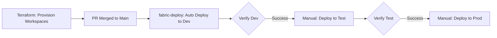
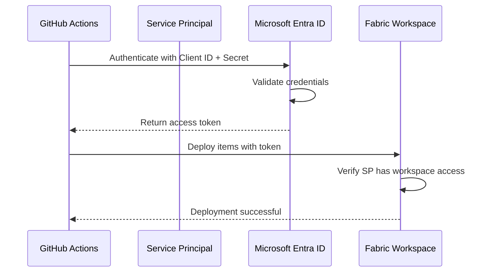
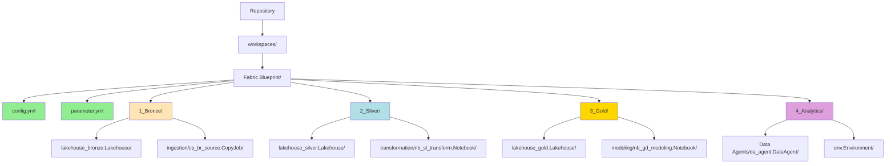

# Deployment Workflow

Understand the CI/CD pipeline workflow for deploying Microsoft Fabric workspaces.

**⏱️ Reading Time**: 10-15 minutes

## Overview

This repository uses a trunk-based development workflow with two independent pipelines:

| Workflow | File | Purpose | Trigger |
|---|---|---|---|
| **Terraform** | `terraform.yml` | Provision Fabric workspaces | Push to `main` touching `terraform/**`, or manual |
| **Fabric Deploy** | `fabric-deploy.yml` | Deploy items into existing workspaces | Push to `main` touching `workspaces/**`, or manual |

Terraform owns the workspace lifecycle. The deployment pipeline only deploys items — it requires workspaces to already exist.

## Deployment Pipeline Flow



## Terraform Workflow (terraform.yml)

Manages the Fabric workspace lifecycle. Runs infrequently — only when workspace configuration changes.

**Triggers:**
- Push to `main` touching `terraform/**` → applies to Dev automatically
- Manual `workflow_dispatch` → applies to chosen environment (dev / test / prod)

**Steps:**
1. `terraform init` — initialise provider and remote state
2. `terraform validate` — check HCL syntax
3. `terraform plan` — show planned changes
4. `terraform apply` — create/update workspaces and role assignments

Test and Prod jobs are protected by GitHub Environment rules requiring manual approval.

## Fabric Deploy Workflow (fabric-deploy.yml)

Deploys items into pre-existing workspaces. Runs on every workspace change.

**Triggers:**
- Push to `main` touching `workspaces/**` → deploys to Dev automatically
- Manual `workflow_dispatch` → deploys to chosen environment

**Steps:**
1. Checkout repository
2. Set up Python and install dependencies
3. Authenticate with Service Principal (`ClientSecretCredential`)
4. Scan for unmapped IDs (`check_unmapped_ids.py`)
5. Deploy all workspaces using `deploy_to_fabric.py` + `fabric-cicd`
6. Upload deployment results artifact

## Deployment Environments

| Environment | Terraform Trigger | Items Trigger | Approval Required |
|---|---|---|---|
| **Dev** | Auto on `terraform/**` push | Auto on `workspaces/**` push | No |
| **Test** | Manual dispatch | Manual dispatch | Optional |
| **Production** | Manual dispatch | Manual dispatch | Optional |

## Authentication Flow



## Deployment Process

For each workspace in the `fabric-deploy.yml` run:

1. **Auto-Discover Workspaces** — find all workspace folders with `config.yml`
2. **Authenticate** — login using Service Principal (`ClientSecretCredential`)
3. **Transform IDs** — replace environment-specific IDs based on workspace `parameter.yml`
4. **Deploy Items** — publish items using `fabric-cicd` library
5. **Clean Up Orphans** — remove items not present in repository (optional)
6. **Report Status** — display deployment summary and upload artifact

## Workspace Structure



## Triggering Deployments

### Automatic Dev Deployment

Merging a PR to `main` with changes in `workspaces/**` paths triggers automatic deployment to Dev.

**Changes that trigger deployment:**
- Adding/modifying workspace items
- Updating `config.yml` or `parameter.yml`
- Changes to workspace folder structure

**Changes that DO NOT trigger deployment:**
- Updates to `.github/` workflows
- Changes to `scripts/` directory
- Documentation updates (`README.md`, `SETUP.md`)
- Changes outside `workspaces/` directory

### Manual Test/Production Deployment

1. Go to **Actions** tab in GitHub
2. Select **Deploy to Microsoft Fabric** workflow
3. Click **Run workflow**
4. Select target environment from dropdown:
   - `dev` - Development environment
   - `test` - Test environment
   - `prod` - Production environment
5. Click **Run workflow** button

## ID Transformation

The pipeline automatically replaces environment-specific IDs during deployment:

| Type | From (Dev) | To (Target Env) |
|------|-----------|-----------------|
| Lakehouse IDs | Dev lakehouse ID | Target env lakehouse ID |
| Workspace IDs | Dev workspace ID | Target env workspace ID |
| SQL Endpoints | Dev SQL endpoint | Target env SQL endpoint |
| Connections | Dev connection ID | Target env connection ID |

### How It Works

1. Deployment script reads `parameter.yml` from each workspace
2. For each transformation rule:
   - Find the Dev value in item definitions
   - Replace with target environment value
   - Use special variables like `$items.Lakehouse.<name>.id`
3. Deploy transformed items to target workspace

## Atomic Deployment with Rollback

All workspace deployments in a single workflow run must succeed together:

```
Deployment Order:
1. Workspace A → Success ✓
2. Workspace B → Success ✓
3. Workspace C → FAILURE ✗

Rollback Triggered:
1. Rollback Workspace B → Restored
2. Rollback Workspace A → Restored
3. Exit with error and failure report
```

This ensures environments remain in a consistent state even when deployments fail.

## Viewing Deployment Logs

1. Go to **Actions** tab in GitHub
2. Select the workflow run
3. Click on job name (e.g., "Deploy to Dev")
4. Expand steps to view detailed logs
5. Look for workspace-specific deployment sections

### Log Sections

- **Authentication** - Service Principal login status
- **Workspace Discovery** - List of workspaces detected
- **ID Transformation** - Applied transformation rules
- **Item Deployment** - Published items per workspace
- **Orphan Cleanup** - Removed items (if enabled)
- **Deployment Summary** - Overall status and statistics

## Multi-Workspace Deployment

The deployment script automatically discovers and deploys all workspace folders:

```
workspaces/
└── Fabric Blueprint/      → Deploys to [D/T/P] Fabric Blueprint
```

Additional workspaces can be added by:
1. Duplicating the `Fabric Blueprint` folder structure
2. Adding corresponding Terraform resources in `terraform/main.tf`
3. Setting variable values in `terraform/environments/*.tfvars`

The workspace name in `config.yml` is the shared contract between Terraform (creates the workspace by that name) and `fabric-cicd` (deploys items into it).

> **Note**: Atomic rollback is a planned feature. Currently, if a workspace deployment fails, the pipeline stops and reports the error, but previously deployed workspaces in that run are not automatically rolled back.

## Best Practices

### Development Workflow

1. **Create feature branch** from `main`
2. **Make changes** to workspace items
3. **Test locally** with private dev workspace
4. **Create PR** to `main`
5. **Get review** and approval
6. **Merge PR** to trigger automatic Dev deployment
7. **Verify Dev** deployment succeeded
8. **Manually deploy to Test** for pre-production validation
9. **Verify Test** deployment succeeded
10. **Manually deploy to Prod** for production release

### Commit Guidelines

- **Small, atomic commits** - One logical change per commit
- **Clear messages** - Describe what and why
- **Group related changes** - Commit related workspace changes together
- **Reference issues** - Link commits to GitHub issues

### Deployment Guidelines

- **Verify before promoting** - Always test in Dev before Test
- **Use manual triggers** - Control when Test/Prod deployments happen
- **Monitor logs** - Review deployment logs for errors
- **Document changes** - Explain what changed and why in PR description

## Troubleshooting Deployments

### Deployment Failed

1. Check workflow logs for specific error message
2. Verify Service Principal has workspace permissions
3. Ensure workspace names match `config.yml`
4. Validate `parameter.yml` syntax and transformation rules
5. Check item definitions are valid JSON/Python

### Rollback Failed

1. Review logs to identify failure point
2. Check Service Principal permissions on all workspaces
3. May require manual restoration of workspace state
4. Verify workspace items can be modified/deleted by Service Principal

### Authentication Failed

1. Verify GitHub secrets are correctly configured
2. Check Service Principal exists in correct Azure AD tenant
3. Ensure client secret hasn't expired (max 2 years)
4. Verify Service Principal has Fabric workspace access

## Resources

- [GitHub Actions Workflows](.github/workflows/)
- [Troubleshooting Guide](Troubleshooting)
- [Workspace Configuration](Workspace-Configuration)
- [GitHub Actions Documentation](https://docs.github.com/actions)
